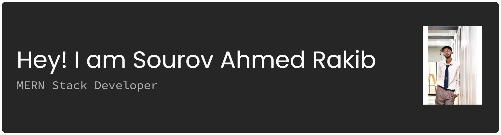

# 🌟 Welcome to My Profile!

---

About Me:

- I am a **MERN**-Stack Developer, passionate about creating Clean and Scalable applications.

Current Work & Activities:

- I am currently exploring **EXPRESS.JS,MONGOBD** for server-side rendering and improved performance.
- I’m actively working on a **FRONTEND** projects using the latest **React** features And exploring UI libraries like **ShadCN**, **MagicUI**.

---

Skills & Technologies:

## Core MERN Stack:

## Frontend Development:

 
\*And UI Libraries: **shadcn/ui**, **Magic UI**

## Cloud & Tools:

---

## Social Links:

---

## Relevant Stats:

&nbsp;

