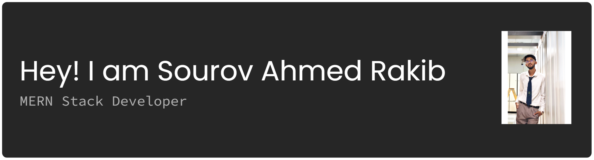

# Sourov Ahmed 👋  
**MERN Stack Developer** | Internship-Ready | Clean & Scalable Web Apps

---

## 👨‍💻 About
MERN Stack Developer passionate about building **modern, scalable, and maintainable** web applications.  
Focused on **real-world projects**, clean UI systems, and efficient backend logic.

---

## 🚀 Featured Projects
- **📚 Library Management System**  
  Authentication, role-based access, CRUD operations  
  **Tech:** React, Express, MongoDB, Firebase

- **🔗 Image Gallery & URL Shortener**  
  Media uploads, short links, dashboard  
  **Tech:** Next.js, MongoDB, shadcn/ui

- **🚦 Traffic Simulation System**  
  Collision prevention & real-world vehicle logic  
  **Tech:** JavaScript, Canvas

---

## 🛠 Tech Stack
**Frontend:** React, Tailwind CSS, HTML, CSS  
**Backend:** Node.js, Express.js, MongoDB  
**UI:** shadcn/ui, Magic UI  
**Tools:** Git, Firebase, VS Code, TypeScript

---

## 🤝 Connect

  
  

---

## 📊 GitHub Activity (Live & Countable)

### 🔥 Contribution Streak (Real-Time)

---

### 📈 Contribution Activity Graph (Live Commits)

---

### 📌 GitHub Stats (Auto-Updated)

---

⭐ *Open to internships, learning opportunities, and collaboration*
